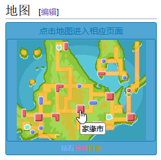
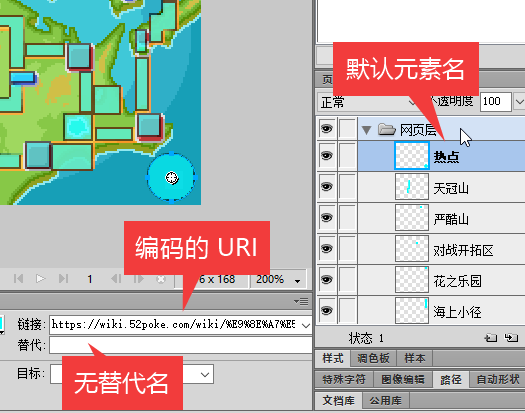

# 神奇宝贝百科地图热点编辑辅助工具
运行环境：此工具为 Adobe Fireworks CS6 的命令脚本。

软件功能：可以在图片内导入和导出 神奇宝贝百科地图热点，方便可视化编辑。

## 背景
玩《晶灿钻石/明亮珍珠》时发现神奥地区地图上没有热点，整张图片是同一个超链接，无法直接点击地图上的位置快速访问我要查看的地点，只能去下面的文字列表框里慢慢查找，非常麻烦。

后来发现[神奥地区](https://wiki.52poke.com/wiki/神奥地区#地图)的主页面上的地图是有热点的，但是是《白金》的老地图了

于是尝试修改模板字符串`{{神奥地图|Pt}}`内的游戏版本，发现`{{神奥地图|BDSP}}`虽然能显示《晶灿钻石/明亮珍珠》的地图图片，但是热点坐标仍然是白金版本的。

于是前往模板源代码查看，发现确实只写了白金的热点数据。要在这种源代码的模式下编辑热点数据也太困难了，所以我决定找一找有没有什么可视化工具可以做。

我印象中网页三剑客里的 Dreamweaver 是可以可视化操作热点的，尝试使用网页内的源代码，确实可以显示出热点的区域。不过自从开始接触 HTML5 的新功能以来，我已经超过 10 年没用过了，现在 Dreamweaver 的界面我已经看不懂了。

但是好在我还有我很熟悉的 Fireworks ，于是我花一个通宵给 Fireworks 写了导入和导出的脚本，这样就可以方便的给新地图图片添加热点了。

## 使用方法
### Fireworks 如何使用命令脚本
#### 单次执行
执行`命令`-`运行脚本`，然后打开需要运行的`.jsf`脚本即可。

#### 加入菜单重复使用
将`.jsf`文件放入以下两个目录之一，重启 Fireworks 即可显示在命令菜单里。
* 个人数据目录（对当前用户生效），文件管理器地址栏输入：  
`%AppData%\Adobe\Fireworks CS6\Commands\`
* Fireworks 安装目录（对所有用户生效），默认为：  
`C:\Program Files (x86)\Adobe\Adobe Fireworks CS6\Configuration\Commands\`

### 开始编辑地图热点
#### 导入地图热点
访问地图模板，从模板源代码中获取到形如`rect 23 144 37 150 [[２０１号道路（神奥）]]`这部分的热点坐标值，每行一个。将它们保存到本地的一个文本文件里。

由于 Fireworks 的引擎和文档不完善，未能找到如何读取`UTF-8`文件，目前需要使用`ANSI(GBK)`等编码输入数据。

在 Fireworks 内打开地图图片，运行`导入地图热点`功能，选择刚才保存的地图热点坐标列表文件。你将会看到热点添加到了画面上。

#### 编辑现有热点/新增热点
指针工具可以移动现有坐标，或编辑多边形坐标的顶点。

工具栏的 Web 区第一个图标就是热点工具，你可以使用这些工具添加新的热点区域。

建议在图层里面为热点命名

如果需要使用模板字符串，请写在替代里（不含两边的双括号），模板字符串的优先级最高，直接忽视链接或元素名。

#### 导出 Wiki 地图热点代码
运行`导出地图热点`功能，选择一个地方填入文件名。（注意需要自己输入完整的文件扩展名）

打开导出的文件即可以看到 Wiki 里面使用的代码了。

**注意**
* 模板里最后一行的`desc none`是干什么用的我不了解，所以需要你自己加上。
* 导出的格式是 UTF-8，但是导入时无法正确读取 UTF-8 编码，是 Fireowrks 引擎不完善导致的，如果需要再次导入请自己转换到 GBK 编码。

### 更多细节
#### 直接导出网页测试
如果你像下图一样完整的填写了`链接`、`替代`，可以直接从 Fireworks 导出一个可以使用的网页进行测试。

点击`文件`-`导出`

选择导出` HTML 和图像`

用浏览器打开刚才导出的网页既可以进行测试

#### 名称判定逻辑情况的说明

因为神奇宝贝百科的热点链接`[[页面名]]`可以额外设定显示名`[[页面名|显示名]]`，对应到 Fireworks 软件内如下 3 处可以设定名称的地点。

上图所示 3 处编辑位置采取如下选择逻辑：

* **模板字符串**：当`替代名`里面有`|`字符时，强制使用`{{替代名}}`作为模板字符串，忽略**页面名**和**显示名**
* **页面名**：按`链接`→`替代名`→`元素名`的优先级使用。当没有填写`链接`时，使用`替代名`，`替代名`为空时使用`元素名`。
* **显示名**：按`替代名`→`元素名`的优先级使用，如果都不设定，或与页面名相同，则忽略。

因此上图生成的代码为`circle 201 154 12 [[鎧島|假设有个铠岛]]`。

如果不设定`替代名`和`元素名`，如下图未设定元素名，元素名显示为默认的“热点”，则会使用链接内的`页面名`。另外下图的链接使用的是浏览器直接复制过来的编码后的 URI，这种 URI 无法在 Wiki 代码内使用，所以我在程序里添加了解码的步骤。

因此上图生成的代码为`circle 201 154 12 [[鎧島]]`。

**注意**：虽然我添加了解码的步骤，但是因为 Fireworks 引擎的 BUG，执行解码后程序会直接闪退，记得提前保存图片工程文件。所以最好还是不要用编码的URL，而是使用原始的汉字 URI。

#### 矩形/圆形 变为多边形

因为 HTML 标准里，热点只有矩形、正圆、多边形三种，因此当你修改圆形热点使其成为椭圆形时，Fireworks 会帮你自动将其转换为近似的多边形。但问题是，数值调整宽高的话，矩形也会被转换成多边形。

变为多边形后，操作一个角会变成单独调整这个点而不是调整矩形长宽。遇到这种情况，将多边形改回矩形即可。

#### 关闭自动对齐
因为地图图片比较小，自动对齐总是对齐到不想要的位置，可以在菜单里关闭 `视图`-`智能辅助线`-`对齐智能辅助线`。这样就不会总是跳过想要的地方了。

